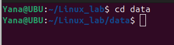

# 🐚 Shell Tutorial – File Permissions with chmod and chown
## 1. Understanding File Permissions in Linux
Each file/directory in Linux has:
  * Owner → The user who created the file.
  * Group → A group of users who may share access.
  * Others → Everyone else.
  ### Permission Types
  * r → Read (4 in numeric)
  * w → Write (2 in numeric)
  * x → Execute (1 in numeric)
  ### Permission Layout
  Example from `ls -l:`
  >-rwxr-xr--

  Breakdown:
  * `-` → Regular file (`d`= directory, `l`= symlink, etc)
  * `rwx` → Owner has read, write, execute
  * `r-x` → Group has read, execute
  * `r--` → Others have read only
  ##  2. chmod – Change File Permissions
  ### Syntax
  >chmod [options] mode filename

  Modes can be set in numeric (octal) or symbolic form.
 

### (A) Numeric (Octal) Method
Each permission is represented as a number:
   * Read = 4
   * Write = 2
   * Execute = 1
Add them up:
   * `7 = rwx`
   * `6 = rw-`
   * `5 = r-x`
   * `4 = r--`
   * `0 = ---`
### Example:
>chmod 755 script.sh

Meaning:
   * Owner: 7 → `rwx`
   * Group: 5 →  `r-x`
   * Others: 5 →  `r-x`
### (B) Symbolic Method
Use `u` (user/owner), `g` (group), `o` (others), `a` (all). Operators:
   * `+` → Add permission
   * `-` → Remove permission
   * `=` → Assign exact permission
Examples:
>chmod u+x script.sh     # Add execute for owner

 

>chmod g-w notes.txt     # Remove write from group

>chmod o=r file.txt      # Set others to read only

>chmod a+r report.txt    # Everyone gets read access

### (C) Recursive Changes
>chmod -R 755 /mydir
   * `-R` → applies changes recursively to all files/subdirectories.

   

   
## 3. chown – Change File Ownership
### Syntax
>chown [options] new_owner:new_group filename

### Examples:
>chown vibhu file.txt           # Change owner to user 'vibhu'

>chown vibhu:dev file.txt       # Change owner to 'vibhu' and group to 'dev'

>chown :dev file.txt            # Change only group to 'dev'

>chown -R vibhu:dev /project    # Recursive ownership change

## 4. Putting It All Together
### Example Scenario:
>touch project.sh

>ls -l project.sh

Output:
>-rw-r--r-- 1 vibhu dev 0 Aug 19 12:00 project.sh

Now
>chmod 700 project.sh       # Only owner has rwx

>chmod u+x,g-w project.sh   # Add execute for user, remove write for group

>chown root:admin project.sh # Change owner to root and group to admin

## 5. Quick Reference Table
## 🔹 5. Quick Reference Table

| Numeric | Permission | Meaning      |
| ------- | ---------- | ------------ |
| 0       | ---        | No access    |
| 1       | --x        | Execute only |
| 2       | -w-        | Write only   |
| 3       | -wx        | Write + Exec |
| 4       | r--        | Read only    |
| 5       | r-x        | Read + Exec  |
| 6       | rw-        | Read + Write |
| 7       | rwx        | Full access  |

---
✅ Key Tip: Use numeric for quick settings (e.g., 755, 644) and symbolic for fine adjustments (`u+x`, `g-w`).

